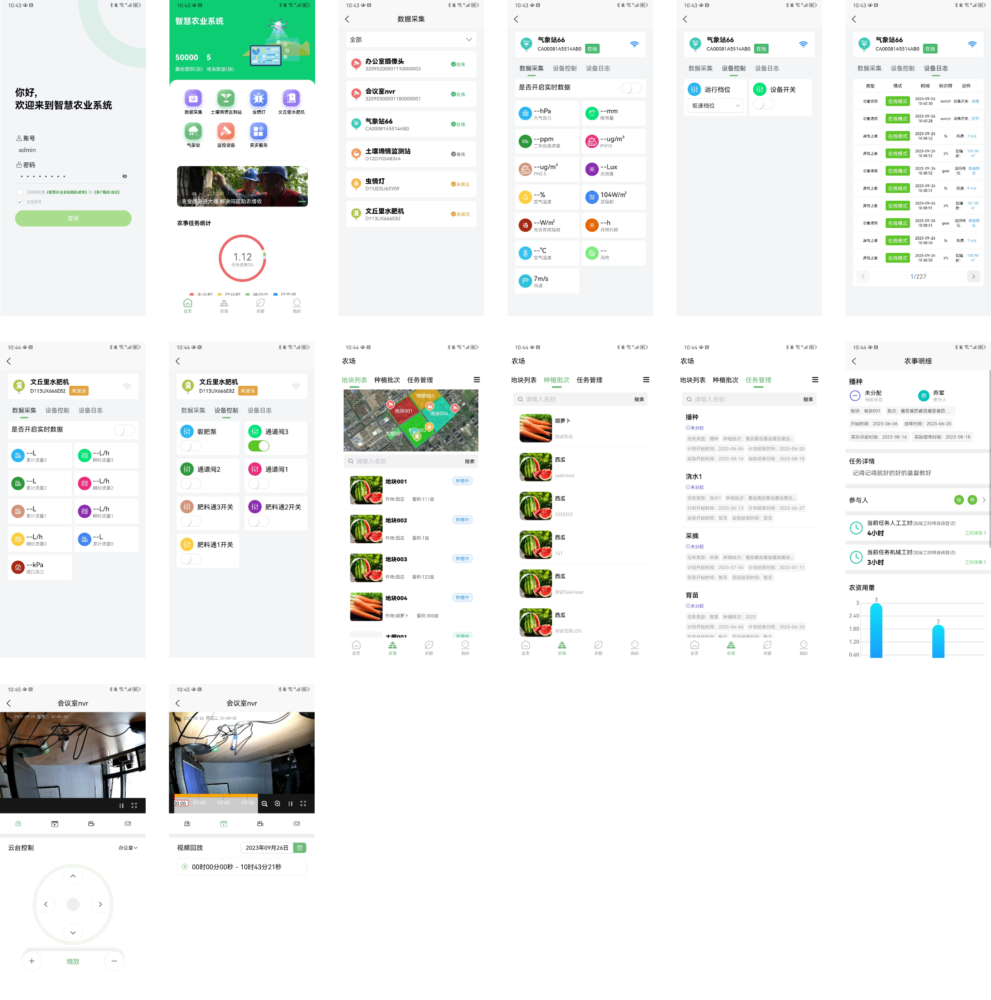

https://github.com/zosoftware/frog-smart-agriculture

## Project Introduction

Frog Smart Agriculture Platform - Supporting IoT devices, agricultural equipment integration, GB28181 camera access (IPC, NVR), and multiple protocols including MQTT, TCP, Modbus, and RS485. Mobile support includes Android, iOS, and H5 applications. Features include agricultural management and product traceability (including traceability H5).

> Official Website: https://zosoftware.yuque.com/org-wiki-zosoftware-ms7q4x/frog
>
> Demo Access: (Due to increased traffic, please contact customer service for demo access)
>
> Contact: neal_tsiao (WeChat ID), please specify your purpose when adding

## Technology Stack

### Backend
- Core Technologies: Spring Boot, MyBatis, Spring Security, JWT, MySQL, Redis, TDengine, EMQX, Netty
- Development Tool: IntelliJ IDEA

### Web Frontend
- Core Technologies: ES6, Vue, Vuex, Vue-router, Vue-cli, Axios, Element-UI
- Development Tool: Visual Studio Code

### Mobile Applications (WeChat Mini Program / Android / iOS / H5)
- Core Technologies: uni-app, [uView](https://gitee.com/link?target=https%3A%2F%2Fwww.uviewui.com%2F), [uChart](https://gitee.com/link?target=https%3A%2F%2Fwww.ucharts.cn%2F)
- Development Tool: HBuilder

## Device Types

### IoT Devices
- Supports MQTT and TCP devices
- Cameras: Supports various camera brands (must support GB28181 protocol)

## Feature Overview

### Dashboard

### Data Visualization

### Mobile Interface

### Farm Management
The farm management module includes: map management, staff management, agricultural machinery category management, machinery information management, agricultural supplies category management, supplies information management, seed system, plot management, task management, and agricultural information.

#### Key Features:

##### Map Management
Centralized management of devices and plot information, supporting device and plot search and location, device addition/editing, and plot modification/drawing.

##### Plot Management
Supports plot drawing with customizable border colors and transparency, and area coverage colors and transparency.

##### Seed System
Maintains seed information, planting methods, seed introductions, and standard operating procedures.

##### Batch Management
Create new batches and generate batch tasks according to seed standards.

##### Agricultural Task Management
Support batch task queries with Gantt chart preview mode.

Managers can maintain task execution details including personnel, work hours, machinery, agricultural supplies, and processing videos/images.

### Device Management

#### IoT Gateway Devices
Supports device access with gateway communication supporting TCP, UDP, MQTT, WebSocket, Modbus, and more, enabling universal connectivity with visual programming capabilities.

#### Thing Model
Abstracts devices into models with three types: device properties, methods, and events, enabling property reporting, control, and event triggering.

#### Product Management
Manages products of the same type with thing model configuration and authentication settings, supporting both IoT devices and camera devices (IPC, NVR).

#### Device Management
View device basic information including online status.

Universal device interface with drag-and-drop layout, real-time data reporting, and device control.

Supports device scheduled tasks.

Device sharing and multi-user management.

Device log viewing for property reporting and device control.

Statistical analysis of reported properties with report generation.

#### Specialized Device Interfaces
- Insect Monitoring Light

- Water-Fertilizer Machine

#### Scene Linkage
Set trigger conditions for automated actions.

#### Monitoring
GB28181-2016 compliant camera access with pan, zoom, streaming, and playback controls. Test latency under 500ms.

Single Screen View:

### Product Traceability

#### Traceable Products
Create traceable products linked to origin, seed variety, plot, agricultural management, and monitoring devices for easy traceability queries.

#### Seed Variety Traceability Query

#### Traceability Version
Traceability code batch management for products.

#### Traceability H5
 